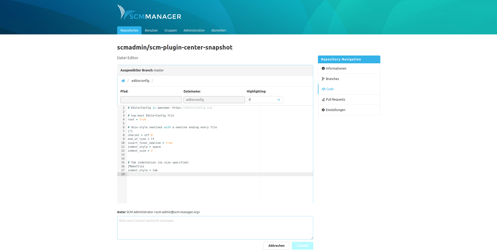

Zum Erstellen bzw. zum Ändern einer Textdatei wird ein Editor geöffnet. Der Editor unterstützt Syntax-Highlighting für alle gängigen Programmiersprachen und Dateiformate. 

Folgende Informationen bzw. Interaktionen bietet der Editor:

- **Ausgewählter Branch:** Die Datei wird mit einem neuen Commit auf diesem Branch erzeugt bzw. modifiziert.
- **Pfad:** Der Dateipfad, in dem die Datei angelegt wird (beim Bearbeiten einer vorhandenen Datei ist dieses Feld nicht änderbar).
- **Dateiname:** Der Name der Datei  (beim Bearbeiten einer vorhandenen Datei ist dieses Feld nicht änderbar).
- **Highlighting**: Auswahl der angezeigten Highlightings. Der Editor ermittelt, sofern verfügbar, eigenständig ein passendes Highlighting. Zusätzlich kann über das Dropdown die Auswahl geändert werden.
- **Inhalt:** Der Inhalt der neuen bzw. geänderten Datei.
- **Autor:** Dieser Benutzer wird als Autor in den neuen Commit geschrieben.
- **Commit Nachricht:** Die Nachricht für den neuen Commit.
