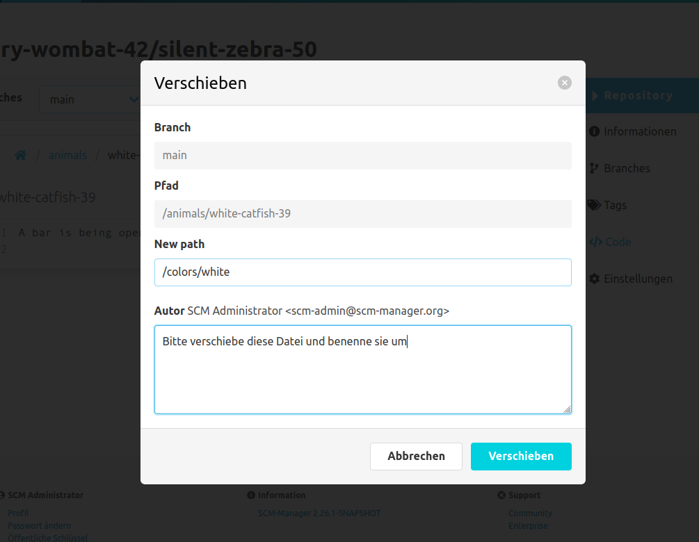

Beim Verschieben einer Datei öffnet sich ein Dialog, in dem der Zielpfad und die Nachricht für den neuen Commit eingegeben werden muss.
Der Zielpfad ist absolut und muss daher mit einem "/" beginnen, "\" sind nicht zulässig.
Falls das Zielverzeichnis noch nicht existiert, wird es automatisch angelegt.
Wenn der Dateiname im Zielpfad vom Original abweicht, wird die Datei umbenannt. Dies gilt auch für Ordner.

