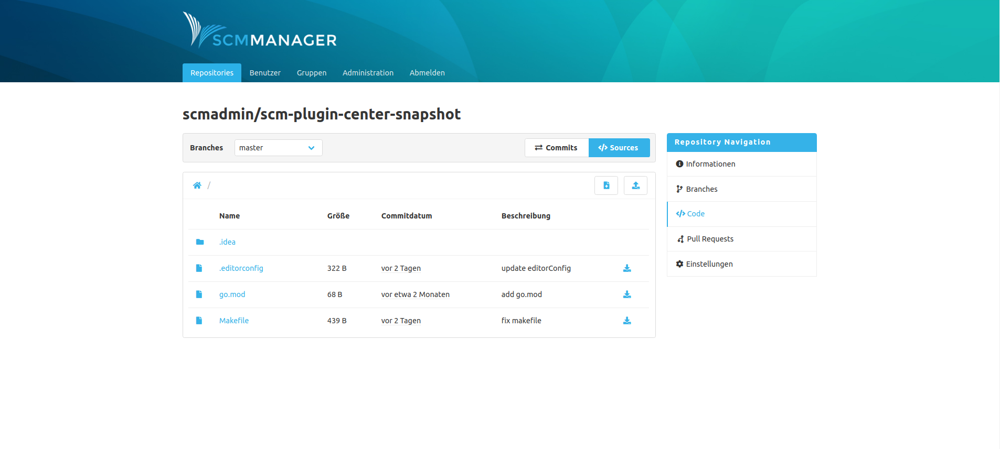

Das Editor Plugin erlaubt es, Dateien direkt innerhalb des SCM-Managers zu erstellen, hochzuladen, zu ändern oder zu löschen. Diese Änderungen werden durch den SCM-Manager als Commits in dem Repository durchgeführt. Von daher können Änderungen auch nur auf Branches durchgeführt werden (ausgenommen Subversion). Über zusätzliche Plugins wie beispielsweise das SCM-BranchWP-Plugin (Branch Write Protection) können Branches oder Bereiche vor Schreibzugriffen geschützt werden, selbst wenn ein Nutzer generelle Schreibzugriffe auf ein Repository hat. 

Hat ein Anwender die Rechte, ein Repository zu bearbeiten, findet er in der Sources-Ansicht die folgenden neuen Buttons:

|Button|Aktion|
|---|---|
| | Neue text-basierte Datei erstellen|
| | Eine oder mehrere Dateien hochladen|

Ferner gibt es in der Detail-Ansicht einer Datei die folgenden neuen Buttons:

|Button|Aktion|
|---|---|
| | Datei löschen|
| | Datei bearbeiten (nur für Textdateien)|
| | Datei herunterladen|
