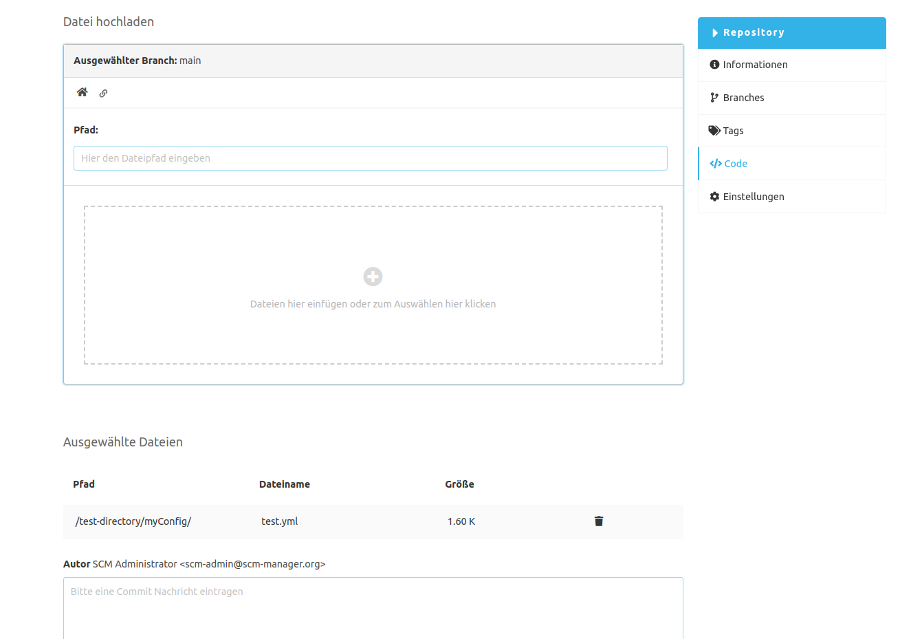

Es können eine oder mehrere Dateien in ein Verzeichnis hochgeladen werden. Existiert bereits eine dieser Dateien, so werden diese überschrieben.
Wird beim Hochladen per Drag-&-Drop ein Verzeichnis hingefügt, werden alle Dateien einschließlich der Verzeichnis-Struktur hochgeladen.
Beim Hinzufügen von Dateien über den Datei-Selektor werden Verzeichnisse ignoriert.

Hierzu gibt es die folgenden Angaben:

- **Ausgewählter Branch:** Die Dateien werden mit einem neuen Commit auf diesem Branch erstellt.
- **Pfad:** Der Dateipfad, in dem die neuen Dateien angelegt werden. Der Dateipfad kann über das Eingabefeld angepasst werden.
- **Dateiauswahl:** Auf diesen Bereich können die gewünschten Dateien per Drag-&-Drop gezogen werden. Durch einen Klick in diesen Bereich wird ein Dateiauswahldialog geöffnet. Es können mehrfach Dateien ausgewählt werden.
- **Ausgewählte Dateien:** Hier werden die Dateien aufgelistet, die hochgeladen werden sollen. Fälschlicherweise gewählte Dateien können aus der Liste wieder entfernt werden.
- **Autor:** Der eingeloggte SCM-Benutzer wird als Autor in den neuen Commit geschrieben.
- **Commitnachricht:** Es muss eine neue Nachricht für den Commit eingetragen werden.

### Navigation

| Tastenkürzel          | Beschreibung                                                                                   |
|-----------------------|------------------------------------------------------------------------------------------------|
| Enter oder Leertaste  | Im Uploadbereich: Öffnet Ansicht, um Dateien zum Hochladen auszuwählen                         |
| Strg + Enter          | Fokussiere die Commitnachricht (außerhalb der Commitnachricht)                                 |
| Strg + Enter          | In der Commitnachricht: Schicke den Commit mit hochzuladenden Dateien ab (bei valider Eingabe) |
