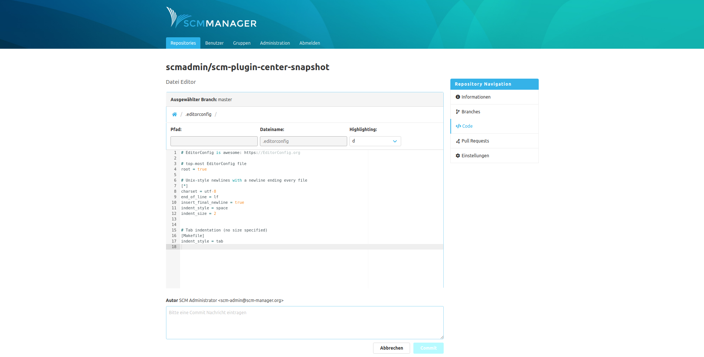

To create or modify a text file, the editor opens. The editor supports syntax highlighting for all common languages and
file formats.

The editor offers this information and interactions:

- **Selected branch:** The file will be created or modified by a commit on this branch.
- **Path:** The path where the file will be created. (When modifying a file, this field cannot be edited.)
- **Filename:** The name of the file. (When modifying a file, this field cannot be edited.)
- **Highlighting:** Selection of the highlighting in use. The editor automatically detects a fitting highlighting, if available. In addition, the highlighting can be changed manually through the dropdown.
- **Content:** The content of the new or modified file.
- **Author:** This user is used as author for the new commit.
- **Commit message:** The commit message.

Whenever the user refocuses the editor, it will check for new revisions of the branch or the repository. If there is a
new revision, a warning is shown and the commit cannot be triggered. If such a new revision is not detected beforehand,
a commit will be rejected by the server and a "concurrent modification error" will be shown.
