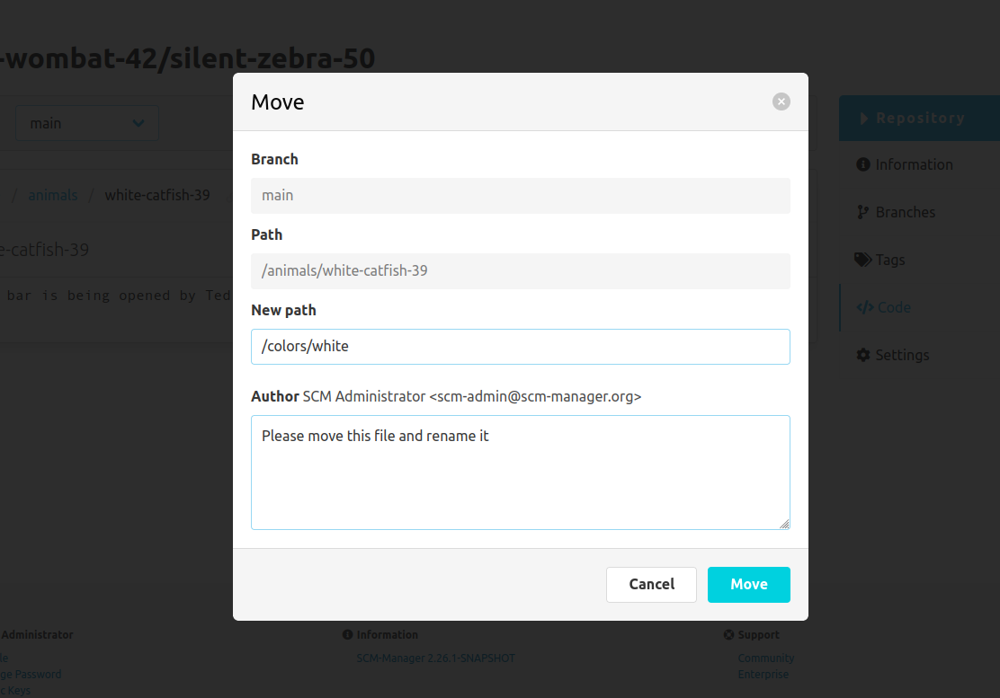

The deletion of a file requires a destination path and a commit message, which is provided in a dialog window.
The destination path has to be absolute and therefore has to start with a `/`, `\` are not supported.
If the target directory does not exist, it is created automatically.
If the destination file name differs from the original, the file will be renamed. This is also true for folders. 

