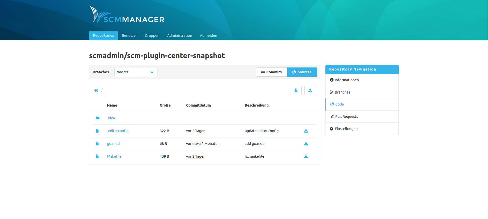

The editor plugin allows to create, upload, modify and delete files directly in SCM-Manager. These changes are executed as commits by SCM-Manager. Therefore, changes can only be performed on branches (except for Subversion). By using additional plugins, like for example the SCM-BranchWP plugin (branch write protection) it is possible to protect branches or certain areas of a repository from write access, even if users generally have write access for a repository.

If a user has the right to modify a repository, there are these new buttons in the sources view:

|Button|Action|
|---|---|
| | Create a new text-based file|
| | Upload one or more files|

In addition, there are these new buttons in the details view of a file:

|Button|Action|
|---|---|
| | Delete file|
| | Edit file (only for text files)|
| | Download file|
