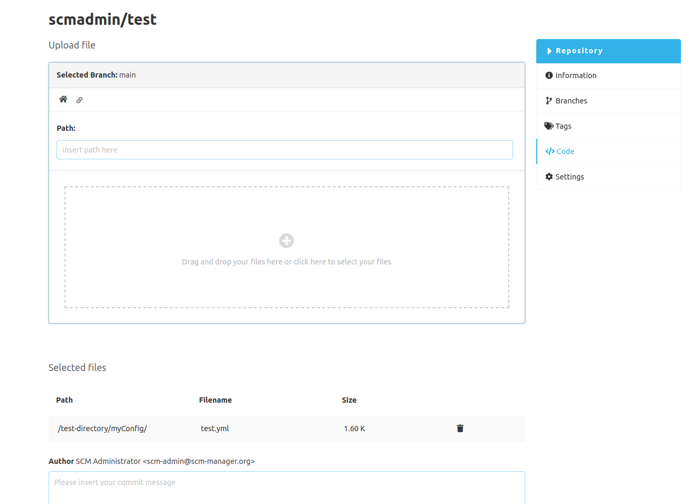

One or more files can be uploaded into a folder. If a file already exists, it will be overwritten.
If a folder is added via drag-&-drop when uploading, all files including the folder structure are uploaded. 
Adding files via the file selector will ignore folders.

The upload offers these information and interactions:

- **Selected branch:** The file(s) will be created on this branch with a new commit.
- **Path:** The path where the new file(s) will be created. The path can be changed.
- **File selection:** The files that are to be uploaded can be added here using drag and drop. By clicking into this area, a file selection dialog is opened. Several files can be selected.
- **Selected files:** A list of all files that are to be uploaded. It is possible to delete files from this list.
- **Author:** This user is used as author for the new commit.
- **Commit message:** The commit message.

### Navigation

| Key Combination | Description                                                                          |
|-----------------|--------------------------------------------------------------------------------------|
| Enter or Space  | Within upload zone: Opens view for file upload selection                             |
| Ctrl + Enter    | Focus on commit message (outside commit message field)                               |
| Ctrl + Enter    | Within commit message field: Send commit with files to upload (requires valid input) |
